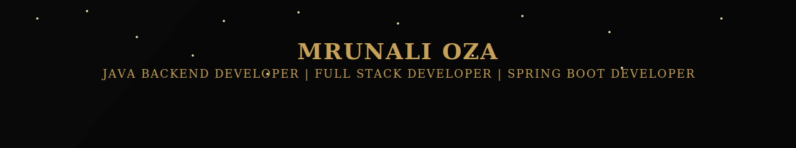
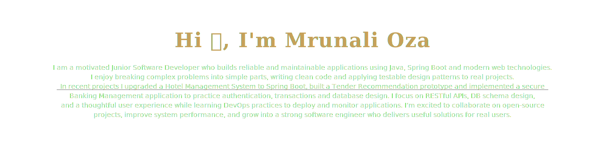
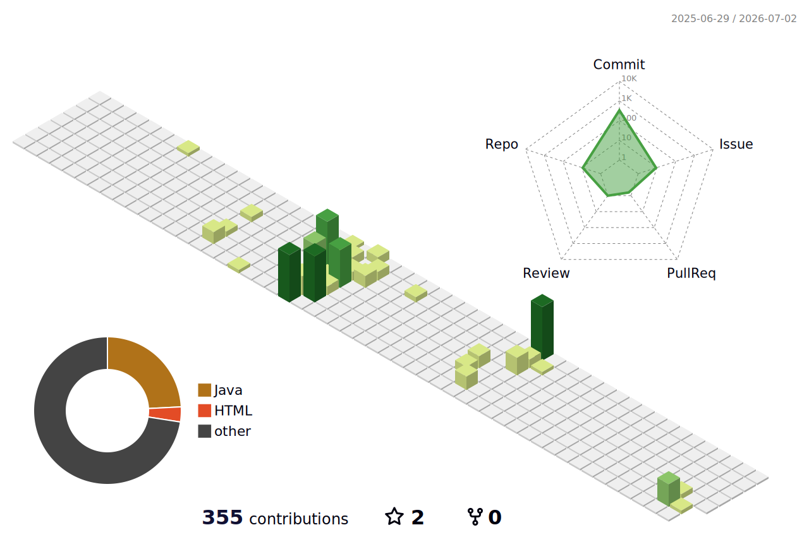

<!-- --------------------------------------------- -->
<!-- SECTION 1 — GOLD NAME BANNER (STATIC IMAGE)   -->
<!-- --------------------------------------------- -->

  

<!-- ------------------------------------------------------------- -->
<!-- SECTION 2 — FULL WIDTH ANIMATED GOLD PARTICLE NAME BANNER     -->
<!-- ------------------------------------------------------------- -->

  

<!-- ----------------------------- -->
<!-- SECTION 3 — PROFILE VIEWS     -->
<!-- ----------------------------- -->

  
    
  

  
    
  

<!-- ----------------------------------------- -->
<!-- SECTION 5 — SKILLS (COLORFUL SMALL ICONS) -->
<!-- ----------------------------------------- -->
## 🛠️ Skills  

  <!-- Example icons -->
  
  
  
  
  
  

<!-- ----------------------------------------------------- -->
<!-- SECTION 6 — EXTRA INFO (LEFT TEXT + RIGHT ILLUSTRATION) -->
<!-- ----------------------------------------------------- -->  

<table>
<tr>

<td width="50%">

<!-- LEFT SIDE TEXT -->
- 💼 I’m actively seeking opportunities to grow as a full-stack or backend developer.  
- 📚 Currently improving my Spring Boot skills and learning DevOps essentials.  
- 📂 Projects: **https://github.com/MrunaliOza04**  
- 💬 Ask me about Java, Spring Boot, JDBC, Servlets, MySQL  
- 📧 Email: **mrunalioza4004@gmail.com**  
- 🔗 Know more: **LinkedIn**  
- 🎉 Fun fact: I love experimenting with new tech and building useful apps.

</td>

<td width="50%" align="center">
  
</td>

</tr>
</table>

<!-- ------------------------------------------------- -->
<!-- SECTION 7 — CONNECT WITH ME (BADGES STYLE CLEAN) -->
<!-- ------------------------------------------------- -->
<!-- ------------------------------------------------- -->
## 🤝 Connect With Me  

<!-- LinkedIn -->

<!-- Naukri -->

<!-- LeetCode -->

<!-- Email -->

<!-- -------------------------------------------------------- -->
<!-- SECTION 8 — LANGUAGES & TOOLS (GRID LARGE ICONS STYLE)   -->
<!-- -------------------------------------------------------- -->
## 🧰 Languages & Tools

  
  
  
  
  
  

<!-- ------------------ INSERTED INTERACTIVE SECTIONS BELOW LANGUAGES & TOOLS ------------------ -->

---
## 🎮 Tic Tac Toe — AI Powered  

  

✨ Features  
- ⚡ Instant gameplay (no GitHub Actions)  
- 🤖 AI levels: Easy, Medium, Hard  
- 🌈 Neon animations + responsive design  
- 🎯 Built with JavaScript + CSS  

---
<!--
## 🏅 Badge Unlock Game
Track your engagement and unlock badges!
- ⭐ **Bronze Explorer:** 10 profile visits (tracked via visitor-counter)
- 🥈 **Silver Contributor:** 1 PR in any repo
- 🥇 **Gold Achiever:** 5 helpful issue comments
- 💎 **Diamond Supporter:** Star 3 of my repositories

*How badges are awarded (suggested setup):*  
- Profile visits: ghpvc or a visitor-counter action + simple JS badge generator.  
- PRs / Issues / Stars: GitHub Actions listening to repository events and updating a small JSON/badge file in the repo.
*/

---

## 🎉 Random Fun Fact
Enjoy a new fun fact every time you refresh:

-->
---
<!-- ----------------------------- -->
<!-- SECTION a — Achievements section -->

<!-- --------------------------------------------- -->
<!-- SECTION 9 — PROJECTS (3 HORIZONTAL CARDS)     -->
<!-- --------------------------------------------- -->
## 🚀 Projects  

<table>
  <tr>
    <!-- IMAGES ROW -->
    <td align="center" width="33%">
      
    </td>
    <td align="center" width="33%">
      
    </td>
    <td align="center" width="33%">
      
    </td>
  </tr>

  <!-- DESCRIPTION ROW -->
  <tr>
    <td align="center">A Spring MVC + JSP based room management app.</td>
    <td align="center">Recommends tenders using Java logic.</td>
    <td align="center">Login, add room, remove room, book room.</td>
  </tr>

  <!-- LINKS ROW -->
  <tr>
    <td align="center">
      <a href="https://github.com/MrunaliOza04/Hotel-Management-System--Spring">🔗 View Project</a>
    </td>
    <td align="center">
      <a href="https://github.com/MrunaliOza04/Tender-Recommendation-System-Java-">🔗 View Project</a>
    </td>
    <td align="center">
      <a href="https://github.com/MrunaliOza04/Hotel-Management-System--Spring">🔗 View Project</a>
    </td>
  </tr>
</table>

<!-- -------------------------------- -->
<!-- SECTION 10 — GITHUB STATS        -->
<!-- -------------------------------- -->
## 📈 GitHub Stats  

  
  

---

<!-- -------------------------------- -->
<!-- SECTION 10 — GITHUB 3D Insights        -->
<!-- -------------------------------- -->
## 🌌 GitHub Insights

<!-- 3D CONTRIBUT GRAPH -->

---

<!--

<!-- MAIN STATS -/->

---

<!-- STREAK --/>

---

<!-- TROPHIES -/->

-->

---

**Building Secure AI Systems | Spring Boot Backend Developer | Future Product Engineer 🚀**

---

<!-- -------------------------------- -->
<!-- SECTION 11 — FOOTER MESSAGE      -->
<!-- -------------------------------- -->

  ✨ Thank you for visiting my profile! ✨  

  Made with ❤️ by <strong>Mrunali Oza</strong>

